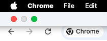

# MacOS-Chrome-TabBar-Gap-Remove
Very recently, after a certain update, my Chrome's tab bar shows an unpleasant gap to the left in full-screen mode.

## Previous Tab Bar

In previous versions, Chrome would display a separate UI for the default windows operation buttons (Maximize, Hide and Close):

  
  

## New Tab Bar

In the latest version, such behavior is replaced by directly showing the buttons on the tab bar:

  
  

And because of that, the tab bar now needs to constantly preserve some spare space for those buttons.

## Solution

Enter [chrome://flags/](chrome://flags/) in Chrome, which will bring you to the setting page of experimental features. Then search **Immersive Fullscreen Toolbar** keywords and set this setting to **Disabled**. After this step, Chrome will automatically prompt to relaunch. After relaunching, your classic tab bar will be back!

